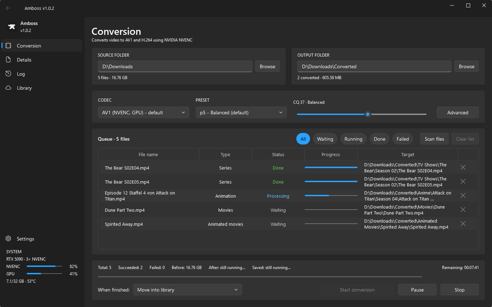
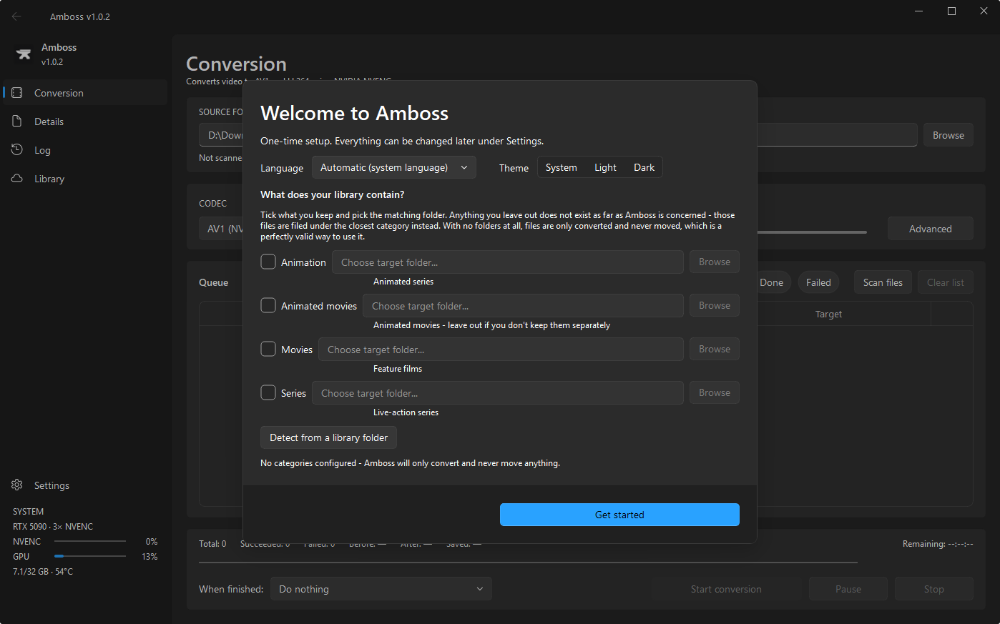

<div align="center">


# Amboss

**Batch video converter for Windows — AV1 and H.264 via NVIDIA NVENC, with
automatic media detection and library filing.**

[Download](../../releases) · [Changelog](CHANGELOG.md) · [License](LICENSE)



</div>

---

Amboss re-encodes a folder of video files to AV1 or H.264 using NVIDIA's hardware
encoder, identifies each file from its name, renames it to a consistent scheme,
and moves the result into the matching folder of a media library.

It is built for unattended batch runs. Select a folder, start the queue, and the
application handles detection, encoding, verification and filing without further
input.

## Detection and filing

Each file is classified during the scan, based on its filename:

| Filename | Detected as |
|---|---|
| `Episode 3 Staffel 1 von Bleach.mp4` | Animated series, season 1, episode 3 |
| `The Bear S02E04 ... .mp4` | Series, season 2, episode 4 |
| `Spirited Away.mp4` | Movie |

Categories are defined by their target folders: point *Movies* at
`\\NAS\Media\Movies`, *Series* at `D:\TV`, and so on. A category with no folder
assigned is treated as non-existent, and anything detected as belonging to it is
filed under the closest category that does exist. A library without a separate
animated-movies folder therefore receives animated movies alongside regular ones,
rather than gaining a directory it was never meant to have.

**Amboss never invents folder names.** The staging directory mirrors the target
folders you configured, and season directories follow whatever convention already
exists in your library — `Season 02`, `Staffel 2`, `シーズン 1`, or plain `2`. The
convention is read from your existing shows, so new episodes land next to the old
ones instead of in a parallel directory. With an empty library, season folders are
numbered, which is the only form that is not wrong in some language.

On first launch, Amboss asks once which categories your library actually has and
where they live. Everything it asks for can be changed later under Settings.



## Behaviour worth knowing about

**All audio tracks and text subtitles are preserved.** FFmpeg's default stream
selection keeps only one track per type; a release with both a dubbed and an
original audio track silently loses one. Amboss maps every audio stream
explicitly and converts text-based subtitles to `mov_text`. Bitmap subtitle
formats that MP4 cannot carry are skipped rather than failing the encode.

**Source files are deleted only after a completely clean run.** Deletion is
deferred until every file in the batch has finished, and each output is verified
against the source duration first. A truncated encode produces a playable file of
the wrong length, which a size check does not catch. If any file fails, no source
is removed.

**Library uploads are verified byte-for-byte.** Every file is compared against
its counterpart before local copies are deleted.

**Loudness can be normalised to EBU R128** (−23 LUFS, true peak −2 dBTP), which
levels out the volume differences between releases from different sources. It is
optional and off by default, since it requires re-encoding the audio rather than
copying it.

**HDR is preserved.** Bit depth, colour primaries, transfer characteristics and
matrix coefficients carry through to the output, so an HDR10 source stays HDR10
rather than arriving washed out.

**Sources are moved to `_InProgress` when a run starts**, leaving the watched
folder free for new downloads while encoding is under way. Scanning alone never
moves or deletes anything.

Additionally: separate quality presets for animation and live action, remaining
time for the whole batch derived from measured throughput, detection of duplicate
downloads (`File.mp4` alongside `File (1).mp4`), a Windows notification on
completion, and an optional shutdown afterwards.

## What survives the conversion

Verified by round-tripping test files through the actual conversion command and
inspecting the result.

| | Result |
|---|---|
| HDR10 — bit depth, primaries, transfer, matrix | Preserved |
| Frame rates up to 144 fps, and 4K | Preserved exactly |
| Multiple audio tracks — AC-3, E-AC-3, DTS, FLAC, AAC | Preserved, all channels |
| SubRip subtitles | Preserved, including basic styling |
| ASS/SSA subtitles | Text, colour, size and weight preserved |
| Chapter marks and stream language tags | Preserved |

## Limitations

These are the cases where something is lost or the file will not convert, and
what causes each one — the MP4 container, the limits of NVENC, or a decision
made here.

**Sources with TrueHD audio fail to convert.** TrueHD — the carrier for Dolby
Atmos on Blu-ray — can be placed in MP4, but FFmpeg classes that combination as
experimental and refuses it unless `-strict -2` is passed, which Amboss does not
do. The result is a failed file rather than a silent loss: the output is
discarded and the source is left alone. Web releases are unaffected, since they
carry Atmos inside E-AC-3, which MP4 handles normally.

**Dolby Vision metadata is expected to be lost.** NVENC does not carry it
through a re-encode. Where a source also has an HDR10 base layer, that base
should survive and the picture stay HDR; a source without one is unlikely to
come out looking right. This is the one entry here that could not be tested —
see below.

**ASS subtitle positioning is lost.** Converting to `mov_text` keeps the text and
its basic appearance but drops absolute positioning and karaoke timing. Typeset
signs in fansubs will appear as plain subtitle lines.

**Bitmap subtitles are dropped.** PGS and VobSub are images, not text, and MP4
cannot store them. They are skipped so the encode still succeeds.

**Sources with 4:4:4 chroma fail.** NVENC's AV1 encoder does not accept them. It
reports `No capable devices found`, a generic message that reads like a missing
or broken GPU but means only that no device supports this particular
combination — the same file encodes fine as H.265 on the same card. Ordinary
releases are 4:2:0 and unaffected.

**Encoding is NVIDIA-only** — see the table below.

### Not verified

Everything above was checked against real files. The following could not be, and
is stated as expectation rather than fact. Reports from anyone able to test these
are welcome.

| | Why it is untested |
|---|---|
| DTS-HD Master Audio | FFmpeg cannot produce a lossless DTS track, so no test file could be built. Core DTS is verified and converts normally. |
| Dolby Vision | Building a stream with a genuine Dolby Vision layer is not possible with the tools at hand. |
| Behaviour on AMD and Intel GPUs | No such hardware available — which is also why those encoders are not implemented. |

## Planned

Nothing here is implemented yet; the list is what would be worth doing next,
roughly in that order.

| | Why |
|---|---|
| H.265 (HEVC) | For players and TVs that predate AV1 |
| MKV as an output container | Removes the lossless-audio and bitmap-subtitle limitations above |
| Software encoding (SVT-AV1) | Makes the application usable without a suitable GPU |
| AMD (AMF) and Intel (Quick Sync) | Hardware encoding for the remaining vendors |

## Requirements

- Windows 10 or 11
- An NVIDIA GPU with NVENC — see below
- FFmpeg and FFprobe. If they are not on `PATH`, Amboss offers to download them
  on first launch and keeps them in its own folder, leaving the system untouched.
  The archive is checked against the publisher's SHA-256 before anything is
  extracted, and nothing is downloaded without asking first.

Output is written as MP4. Releases with AC-3, E-AC-3, DTS or AAC audio convert
without issue and keep every track; a Blu-ray remux with a lossless TrueHD track
will fail rather than lose it. See [Limitations](#limitations).

### Encoder support

The table describes what Amboss implements, which is narrower than what the
hardware can do.

| Encoder | AV1 | H.264 | H.265 |
|---|:--:|:--:|:--:|
| **NVIDIA** — NVENC | ✔ | ✔ | ✘ |
| **AMD** — AMF | ✘ | ✘ | ✘ |
| **Intel** — Quick Sync | ✘ | ✘ | ✘ |
| **CPU** — software encoding | ✘ | ✘ | ✘ |

✔ available · ✘ not implemented

AV1 through NVENC requires a GeForce RTX 4000 series card or newer. H.264 works
on practically any NVIDIA GPU of the past decade.

AMD and Intel are not simply untested. Amboss passes NVENC-specific parameters
throughout — `-cq` for quality, `-preset p1…p7` for speed — and FFmpeg rejects
those for other encoders while still parsing options, long before a GPU is
involved. Supporting them means mapping every parameter per encoder, which is
planned rather than pending, alongside software encoding as a fallback for
machines without a suitable GPU and H.265 for players that predate AV1.

Worth separating, because it is a common source of confusion: playing AV1 back
and producing it are two different hardware capabilities. Nearly every recent
GPU, integrated graphics included, decodes AV1; far fewer can encode it. An
RTX 3080 plays AV1 without effort but cannot create it.

Amboss verifies the selected encoder against FFmpeg on startup and reports a
missing one rather than failing part-way through a batch.

## Installation

Download `Amboss.exe` from [Releases](../../releases) and run it. There is no
installer and nothing is written outside `%APPDATA%\Amboss`.

Running from source:

```
pip install -r requirements.txt
python main.py
```

Building the executable:

```
pyinstaller amboss.spec
```

## Configuration

Settings are stored in `%APPDATA%\Amboss\config.json`, together with `app.log`
and `crash.log`.

The interface is available in English and German; the language follows the system
locale by default and can be changed under Settings. A change takes effect on the
next start.

One option is deliberately not persisted: *shut down PC when finished* resets on
every launch, so a forgotten checkbox cannot power off the machine during a later
session.

## Project layout

| File | Purpose |
|---|---|
| `main.py` | Entry point, language setup, crash logging |
| `models.py` | Data types, constants, category folding |
| `pattern_matcher.py` | Filename-based media detection |
| `path_generator.py` | Target path construction and collision handling |
| `duplicate_detector.py` | Duplicate download detection |
| `inprogress_mover.py` | Moving sources to `_InProgress` |
| `merge_detector.py` | Detection of truncated folder names |
| `library_layout.py` | Reads folder conventions from the existing library |
| `ffmpeg_processor.py` | FFmpeg and FFprobe invocation |
| `workers.py` | Conversion and upload, off the UI thread |
| `i18n.py` | Interface translations |
| `ui/` | User interface |

## License

Licensed under the GNU General Public License v3.0 — see [LICENSE](LICENSE).
Amboss links PyQt5 and PyQt-Fluent-Widgets, both distributed under the GPLv3,
which applies to the combined work.

AV1™ is a trademark of the Alliance for Open Media. Amboss implements the AV1
specification and is not affiliated with, endorsed by, or certified by the
Alliance for Open Media.
